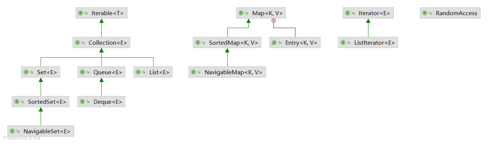
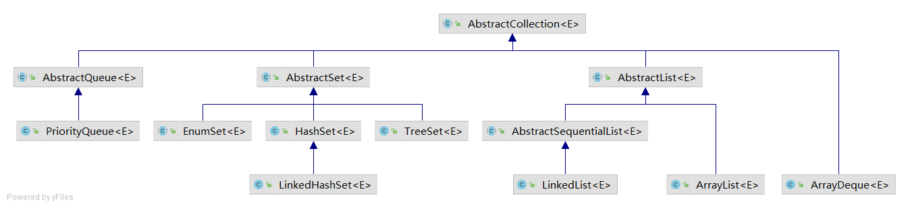
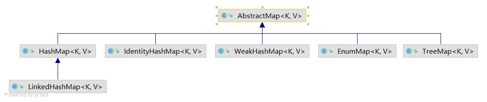
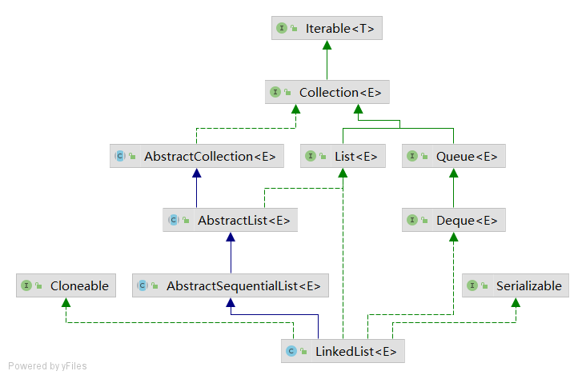
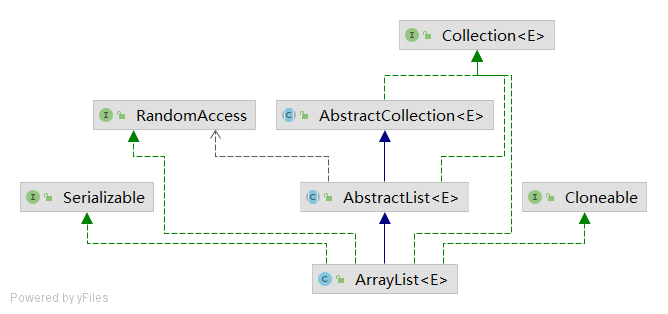
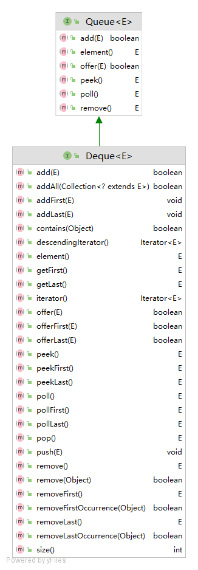
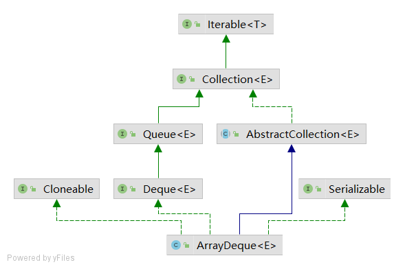
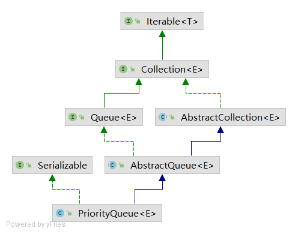
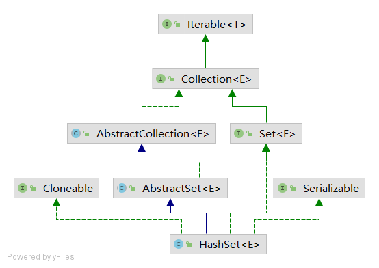
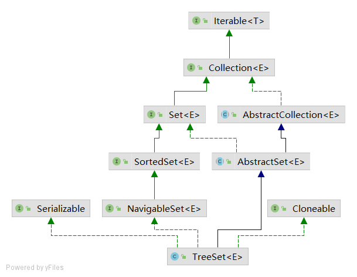

## 第9章 集合

### 9.1 Java集合框架

#### 9.1.1 将集合的接口与实现分离

与现代的数据结构类库的常见情况一样，Java集合类库也将`接口(interface)`与`实现(implementation)`分离。

为什么要这样做？因为根据`接口(interface)`的本质来讲，接口中应抽象出实现类的服务。比如，`队列(Queue)`这个接口中指出可以在队列的尾部添加元素，在队列的头部删除元素，等等。我们抽象出的队列接口最简单的形式会类似于下面这样：

```java
public interface Queue<E> {
    boolean add(E var1);
    E remove();
    E peek();
}
```

对于`实现(implementation)`来讲，队列通常有两种是实现方式：一种是使用循环数组；另一种是使用链表。这就是接口与实现在概念上的不同。不同方式实现的队列都会有队列接口中的方法。下面的例子使用两种方式实现队列功能。

```java
public class CircularArrayQueue<E>implements Queue<E> //not an actual library class
{
    private int head;
    private int tail;
    CircularArrayQueue(int capacity) { . . . }
    public void add(E element) { . . . }
    public E remove0{ . . }
    public int size() { . . . }
    private E[] elements;
}
 
public class LinkedListQueue<E> implements Queue<E> //not an actual library class
{
    private Link head;
    private Link tail;
    LinkedListQueue(){ . . . }
    public void add(E element) { . ..}
    public E remove() {.. . }
    public int size() { . . . }
}
```

实际上，Java中并没有上面例子中的`CircularArrayQueue`和`LinkedListQueue`这两个类，这里只是作为例子阐述实现方式上的不同。在Java中，如果需要一个循环数组队列，可以使用`ArrayDeque`
类。如果需要一个链表队列，就直接使用`LinkedList`类，这个类实现了`Queue`接口。

```java
public class ArrayDeque<E> extends AbstractCollection<E> implements Deque<E>, Cloneable, Serializable
```

```java
public class LinkedList<E> extends AbstractSequentialList<E> implements List<E>, Deque<E>, Cloneable, java.io.Serializable
```

当在程序中使用队列时，一旦构建了集合就不需要知道究竟使用了哪种实现。因此，只有在构建集合对象时，使用具体的类才有意义。可以使用接口类型存放集合的引用。

```java
Queue<Customer>expresslane = new CircularArrayQueue<>(100);
expressLane.add(new Customer("Harry"));
```

利用这种方式，一旦改变了想法，可以轻松地使用另外一种不同的实现。只需要对程序的一个地方做出修改，即调用构造器的地方。如果觉得`LinkedListQueue`是个更好的选择，就将代码修改为：

```java
Queue<Custoaer> expressLane = new LinkedListQueueo();
expressLane.addCnew CustonierC'Harry"));
```

为什么选择这种实现，而不选择那种实现呢？接口本身并不能说明哪种实现的效率究竟如何。循环数组要比链表更高效，因此多数人优先选择循环数组。然而，通常这样做也需要付出一定的代价。

循环数组是一个有界集合，即容量有限。如果程序中要收集的对象数量没有上限，就最好使用链表来实现。

在研究API文档时，会发现另外一组名字以`Abstract`开头的类，例如，`AbstractQueue`。这些类是为类库实现者而设计的。如果想要实现自己的队列类（也许不太可能)，会发现扩展`AbstractQueue`
类要比实现`Queue`接口中的所有方法轻松得多。

```java
public abstract class AbstractQueue<E> extends AbstractCollection<E> implements Queue<E> {
    protected AbstractQueue() { }
    public boolean add(E e) { }
    public E remove() { }
    public E element() { }
    public void clear() { }
    public boolean addAll(Collection<? extends E> c) { }
}
```

#### 9.1.2 Collection接口

在Java类库中，集合类的基本接口是`Collection`接口。这个接口有两个基本方法：

```java
public interface Collection<E> extends Iterable<E> {
    boolean add(E element);
    Iterator<E> iterator();
}
```

除了这两个方法之外，还有几个方法，将在稍后介绍。

`add`方法用于向集合中添加元素。如果添加元素确实改变了集合就返回`true`,如果集合没有发生变化就返回`false`。例如，如果试图向集中添加一个对象，而这个对象在集中已经存在，这个添加请求就没有实效，因为集中不允许有重复的对象。

`iterator`方法用于返回一个实现了`Iterator`接口的对象。可以使用这个迭代器对象依次访问集合中的元素。

#### 9.1.3 迭代器

Iterator接口包含 4个方法：

```java
public interface Iterator<E>
{
    E next();
    booleanhasNext();
    void remove();
    default void forEachRemaining(Consumer<? super E> action);
}
```

通过反复调用`next`方法，可以逐个访问集合中的每个元素。但是，如果到达了集合的末尾，`next`方法将抛出一个`NoSuchElementException`。因此，需要在调用next之前调用`hasNext`
方法。如果迭代器对象还有多个供访问的元素，这个方法就返回`true`。如果想要査看集合中的所有元素，就请求一个迭代器，并在`hasNext`返回`true`时反复地调用`next`方法。例如：

```java
Collection<String> c = . . .;
Iterator<String> iter = c.iterator();
while (iter.hasNext())
{
    String element = iter.next();
    do some thing with element
}
```

用“for each”循环可以更加简练地表示同样的循环操作：

```java
for (String element : c)
{
    do some thing with element
}
```

编译器简单地将“for each”循环翻译为带有迭代器的循环。

“for each”循环可以与任何实现了`Iterable`接口的对象一起工作，这个接口只包含一个抽象方法：

```java
public interface Iterable<E>
{
    Iterator<E> iterator();
    ...
}
```

`Collection`接口扩展了`Iterable`接口。因此，对于标准类库中的任何集合都可以使用“for each”循环。

在JavaSE8中，甚至不用写循环。可以调用`forEachRemaining`方法并提供一lambda表达式（它会处理一个元素）。将对迭代器的每一个元素调用这个`lambda`表达式，直到再没有元素为止。

```java
iterator.forEachRemaining(element -> dosomethingwith element);
```

元素被访问的顺序取决于集合类型。如果对`ArrayList`进行迭代，迭代器将从索引`0`开始，每迭代一次，索引值加`1`然而，如果访问`HashSet`
中的元素，每个元素将会按照某种随机的次序出现。虽然可以确定在迭代过程中能够遍历到集合中的所有元素，但却无法预知元素被访问的次序。这对于计算总和或统计符合某个条件的元素个数这类与顺序无关的操作来说，并不是什么问题。

Java迭代器查找一个元素的唯一方法是调用`next`,而在执行查找操作的同时，迭代器的位置随之向前移动。因此，应该将Java迭代器认为是位于两个元素之间。当调用`next`时，迭代器就越过下一个元素，并返回刚刚越过的那个元素的引用。


`Iterator`接口的`remove`方法将会删除上次调用`next`
方法时返回的元素。在大多数情况下，在决定删除某个元素之前应该先看一下这个元素是很具有实际意义的。然而，如果想要删除指定位置上的元素，仍然需要越过这个元素。例如，下面是如何删除字符串集合中第一个元素的方法：

```java
Iterator<String> it = c.iterator();
it.next();// skip over the first element
it.remove(); //now remove it
```

更重要的是，对`next`方法和`remove`方法的调用具有互相依赖性。如果调用`remove`之前没有调用`next`将是不合法的。如果这样做，将会抛出一个`IllegalStateException`异常。

如果想删除两个相邻的元素，不能直接地这样调用：

```java
it.remove();
it.remove();//Error!
```

相反地，必须先调用next越过将要删除的元素。

```java
it,remove();
it.next();
it.remove(); //OK
```

#### 9.1.4 泛型实用方法

当然，如果实现`Collection`接口的每一个类都要提供如此多的例行方法将是一件很烦人的事情。为了能够让实现者更容易地实现这个接口，Java类库提供了一个类`AbstractCollection`，它将基础方法`size`
和`iterator`抽象化了，但是在此提供了例行方法。例如：

```java
public abstract class AbstractCollection<E> implements Collection<E>
{
    public abstract Iterator<E> iterator();
    public boolean contains(Object obj)
    {
        for (E element : this)//calls iterator()
            if (element,equals(obj))
                return=true;
        return false;
    }
    ...
}
```

此时，一个具体的集合类可以扩展`AbstractCollection`类了。现在要由具体的集合类提供`iterator`方法，而`contains`方法已由`AbstractCollection`
超类提供了。然而，如果子类有更加有效的方式实现`contains`方法，也可以由子类提供，就这点而言，没有什么限制。

对于Java SE8,这种方法有些过时了。如果这些方法是`Collection`接口的默认方法会更好。但实际上并不是这样。不过，确实已经增加了很多默认方法。其中大部分方法都与流的处理有关。另外，还有一个很有用的方法：

```java
default boolean removelf(Predicate<? super E> filter)
```

这个方法用于删除满足某个条件的元素。

### 9.2 集合框架中的接口



集合有两个基本接口：`Collection`和`Map`。我们已经看到，可以用以下方法在集合中插人元素：

```java
boolean add(E element)
```

不过，由于映射包含键 / 值对，所以要用 `put`方法来插人：

```java
V put(K key, V value)
```

要从集合读取元素，可以用迭代器访问元素。不过，从映射中读取值则要使用 `get` 方法：

```java
V get(K key)
```

`List`是一个有序集合`（ordered collection）`元素会增加到容器中的特定位置。可以采用两种方式访问元素：使用迭代器访问，或者使用一个整数索引来访问。后一种方法称为随机`（random access）`
,因为这样可以按任意顺序访问元素。与之不同，使用迭代器访问时，必须顺序地访问元素。`List`接口定义了多个用于随机访问的方法：

```java
void add(int index, E element)
void remove(int index)
E get(int index)
E set(int index, E element)
```

`Listlterator`接口是`Iterator`的一个子接口。它定义了一个方法用于在迭代器位置前面增加一个元素：

```java
void add(E element)
```

坦率地讲，集合框架的这个方面设计得很不好。实际中有两种有序集合，其性能开销有很大差异。由数组支持的有序集合可以快速地随机访问，因此适合使用List方法并提供一个整数索引来访问。与之不同，链表尽管也是有序的，但是随机访问很慢，所以最好使用迭代器来遍历。如果原先提供两个接口就会容易一些了。

`Set`接口等同于`Collection`接口，不过其方法的行为有更严谨的定义。集`（set)`的`add`方法不允许增加重复的元素。要适当地定义集的`equals`
方法：只要两个集包含同样的元素就认为是相等的，而不要求这些元素有同样的顺序。`hashCode`方法的定义要保证包含相同元素的两个集会得到相同的散列码。`SortedSet`和`SortedMap`
接口会提供用于排序的比较器对象，这两个接口定义了可以得到集合子集视图的方法。

最后，Java SE6引人了接口`NavigableSet`和`NavigableMap`,其中包含一些用于搜索和遍历有序集和映射的方法。

### 9.3 集合框架中的类





### 9.4 具体集合

| 常用集合类型    | 描述                                       |
| --------------- | ------------------------------------------ |
| `ArrayList`     | 可以动态增长和缩减的一个索引有序表         |
| `LinkedList`    | 可以在任何位置高效插入和删除的一个有序序列 |
| `ArrayDeque`    | 实现为循环数组的一个双端队列               |
| `PriorityQueue` | 允许高效获得删除最小元素的一个集合（堆）   |
| `HashSet`       | 没有重复元素的一个无序集合                 |
| `TreeSet`       | 一个有序集                                 |
| `LinkedHashSet` | 一个可以记住元素插入次序的集               |
| `HashMap`       | 存储键值对的一个数据结构                   |
| `TreeMap`       | 键有序的一个映射存储结构                   |
| `LinkedHashMap` | 可以记住键值对添加次序的一个映射存储结构   |

#### 9.4.1 链表(`LinkedList`)



```java
List<String>staff = new LinkedList<>(); //LinkedList implements List
staff.add("Amy");
staff.add(MBobH);
staff.add("Carl");
Iterator iter = staff.iterator();
String first = iter.next();//visit first element
String second =iter.next();//visit second element
iter.remove(); //remove last visited element
```

`LinkedList.add()`方法将对象添加到链表的尾部。但是，常常需要将元素添加到链表的中间。由于迭代器是描述集合中位置的，所以这种依赖于位置的`add`
方法将由迭代器负责。只有对自然有序的集合使用迭代器添加元素才有实际意义。因此，在`Iterator`接口中就没有`add`方法。相反地，集合类库提供了子接口`Listlterator`,其中包含`add`方法：

```java
interface ListIterator<E>extends Iterator<E>
{
    void add(E element);
    ...
}
```

与`Collection.add`不同，这个方法不返回`boolean`类型的值，它假定添加操作总会改变链表。另外，`Listlterator`接口有两个方法，可以用来反向遍历链表。

```java
E previous()
boolean hasPrevious()
```

与 `next` 方法一样，`previous`方法返回越过的对象。

`LinkedList` 类的 `listIterator` 方法返回一个实现了 `listIterator` 接口的迭代器对象。

```java
ListIterator<String> iter = staff.listIterator();
```

`add`方法在迭代器位置之前添加一个新对象。例如，下面的代码将越过链表中的第一个元素，并在第二个元素之前添加`“Juliet”`

```java
List<String> staff=newLinkedList<>();
staff.add("Amy");
staff.add("Bob");
staff.add(nCarl");
ListIterator<String> iter = staff.listlterator();
iter.next();//skip past first element
iter.add("3uliet");
```


如果多次调用`add`方法，将按照提供的次序把元素添加到链表中。它们被依次添加到迭代器当前位置之前。当用一个刚刚由`Iterator`方法返回，并且指向链表表头的迭代器调用`add`
操作时，新添加的元素将变成列表的新表头。当迭代器越过链表的最后一个元素时（即`hasNext`返回`false`),添加的元素将变成列表的新表尾。如果链表有`n`个元素，有`n+1`个位置可以添加新元素。这些位置与迭代器的`n+1`
个可能的位置相对应。例如，如果链表包含3个元素，A、B、C，就有4个位置（标有丨）可以插入新元素：

```
|ABC
A|BC
AB|C
ABC|
```

最后需要说明，`set`方法用一个新元素取代调用`next`或`previous`方法返回的上一个元素。例如，下面的代码将用一个新值取代链表的第一个元素：

```java
ListIterator<String> iter = list.listlterator();
String oldValue = iter.next(); //returns first element
iter.set(newValue); // sets first element to newValue
```

在前面已经看到，`Collection`接口中声明了许多用于对链表操作的有用方法。其中大部分方法都是在`LinkedList`类的超类`AbstractCollection`中实现的。例如，`toString`
方法调用了所有元素的`toString`,并产生了一个很长的格式为`[A,B,C]`的字符串。这为调试工作提供了便利。可以使用`contains`方法检测某个元素是否出现在链表中。例如，如果链表中包含一个等于`“Harry”`
的字符串，调用`staff.contains("Harry")`后将会返回`true`。

在Java类库中，还提供了许多在理论上存在一定争议的方法。链表不支持快速地随机访问。如果要查看链表中第`n`个元素，就必须从头开始，越过个`n-1`
个元素。没有捷径可走。鉴于这个原因，在程序需要采用整数索引访问元素时，程序员通常不选用链表。尽管如此，`LinkedList`类还是提供了一个用来访问某个特定元素的`get`方法：

```java
LinkedList<String> list=. .
String obj=list.get(n);
```

当然，这个方法的效率并不太高。如果发现自己正在使用这个方法，说明有可能对于所要解决的问题使用了错误的数据结构。绝对不应该使用这种让人误解的随机访问方法来遍历链表。下面这段代码的效率极低：

```java
for (int i=0; i< list.size();i++)
    do something with list.get(i);
```

每次査找一个元素都要从列表的头部重新开始搜索。`LinkedList`对象根本不做任何缓存位置信息的操作。

列表迭代器接口还有一个方法，可以告之当前位置的索引。实际上，从概念上讲，由于Java迭代器指向两个元素之间的位置，所以可以同时产生两个索引：`nextIndex`方法返回下一次调用`next`
方法时返回元素的整数索引；`previousIndex`方法返回下一次调用`previous`方法时返回元素的整数索引。当然，这个索引只比`nextIndex`
返回的索引值小1。这两个方法的效率非常高，这是因为迭代器保持着当前位置的计数值。最后需要说一下，如果有一个整数索引`n`,`list.listlterator(n)`将返回一个迭代器，这个迭代器指向索引为`n`
的元素前面的位置。也就是说，调用`next`与调用`list.get(n)`会产生同一个元素，只是获得这个迭代器的效率比较低。

```java
public class code_9_3_1 {
    public static void main(String[] args)
    {
        List<String> a = new LinkedList<>();
        a.add("Amy");
        a.add("Carl");
        a.add("Erica");
        List<String> b =new LinkedList<>();
        b.add("Bob");
        b.add("Doug");
        b.add("Frances");
        b.add("Gloria");

        //merge the words from b into a
        ListIterator<String> aIter =a.listIterator();
        Iterator<String> bIter = b.iterator();
        while (bIter.hasNext())
        {
            if (aIter.hasNext()) aIter.next();
            aIter.add(bIter.next());
        }

        System.out.println(a);
        //remove every second word from b

        bIter = b.iterator();
        while (bIter.hasNext())
        {
            bIter.next();//skip one element
            if (bIter.hasNext())
            {
                bIter.next();//skip next element
                bIter.remove(); //remove that element
            }
        }

        System.out.println(b);

        //bulk operation: remove all words in b from a
        a.removeAll(b);
        System.out.println(a);
    }
}
```

输出：

```java
[Amy, Bob, Carl, Doug, Erica, Frances, Gloria]
[Bob, Frances]
[Amy, Carl, Doug, Erica, Gloria]
```

#### 9.4.2 数组列表(`ArrayList`)

前面介绍了 `List` 接口和实现了这个接口的`LinkedList`类。`List` 接口用于描述一个有序集合，并且集合中每个元素的位置十分重要。有两种访问元素的协议：一种是用迭代器，另一种是用`get`和`set`
方法随机地访问每个元素。后者不适用于链表，但对数组却很有用。集合类库提供了一种大家熟悉的`ArrayList`类，这个类也实现了`List`接口。`ArrayList`封装了一个动态再分配的对象数组。



对于一个经验丰富的Java程序员来说，在需要动态数组时，可能会使用`Vector`类。为什么要用`ArrayList`取代`Vector`呢？原因很简单：`Vector`类的所有方法都是同步的。可以由两个线程安全地访问一个`Vector`
对象。但是，如果由一个线程访问`Vector`,代码要在同步操作上耗费大量的时间。这种情况还是很常见的。而`ArrayList`方法不是同步的，因此，建议在不需要同步时使用`ArrayList`,而不要使用`Vector`。

#### 9.4.3 队列与双端队列(`Queue & Deque`)

前面已经讨论过，队列可以让人们有效地在尾部添加一个元素，在头部删除一个元素。有两个端头的队列，即双端队列，可以让人们有效地在头部和尾部同时添加或删除元素。不支持在队列中间添加元素。在Java SE6中引人了`Deque`
接口，并由`ArrayDeque`和`LinkedList`类实现。这两个类都提供了双端队列，而且在必要时可以增加队列的长度。





#### 9.4.4 优先队列(`PriorityQueue`)



Java中`PriorityQueue`通过**二叉小顶堆实现**，可以用一棵完全二叉树表示。优先队列中的元素可以按照任意的顺序插入，但会按照有序的顺序进行检索。也就是说，无论何时掉用`remove`
方法，总会获得当前优先队列中最小的元素。不过，优先队列并没有对所有元素进行排序。优先队列使用**堆**这样的一个数据结构。相关操作和`堆`的操作相同。`PriorityQueue`的方法和`Queue`中的方法一致。


#### 9.4.5 哈希映射(HashMap)

`HashMap`的主干是一个`Entry`数组。`Entry`是`HashMap`的基本组成单元，每一个`Entry`包含一个`key-value`键值对。

```java
//HashMap的主干数组，可以看到就是一个Entry数组，初始值为空数组{}，主干数组的长度一定是2的次幂，至于为什么这么做，后面会有详细分析。
transient Entry<K,V>[] table = (Entry<K,V>[]) EMPTY_TABLE;
```

`Entry`是`HashMap`中的一个静态内部类。代码如下

```java
static class Entry<K,V> implements Map.Entry<K,V> {
        final K key;
        V value;
        Entry<K,V> next;//存储指向下一个Entry的引用，单链表结构
        int hash;//对key的hashcode值进行hash运算后得到的值，存储在Entry，避免重复计算

        /**
         * Creates new entry.
         */
        Entry(int h, K k, V v, Entry<K,V> n) {
            value = v;
            next = n;
            key = k;
            hash = h;
        }
```

所以，`HashMap`的整体结构如下


简单来说，**`HashMap`由数组+链表组成的**，数组是`HashMap`的主体，链表则是主要为了解决哈希冲突而存在的，如果定位到的数组位置不含链表（当前`entry`
的next指向null）,那么对于查找，添加等操作很快，仅需一次寻址即可；如果定位到的数组包含链表，对于添加操作，其时间复杂度为`O(n)`，首先遍历链表，存在即覆盖，否则新增；对于查找操作来讲，仍需遍历链表，然后通过`key`
对象的`equals`方法逐一比对查找。所以，性能考虑，`HashMap`中的链表出现越少，性能才会越好。

在JDK1.6，JDK1.7中，`HashMap`采用数组+链表实现，即使用链表处理冲突，同一`hash`值的链表都存储在一个链表里。但是当位于一个桶中的元素较多，即`hash`值相等的元素较多时，通过`key`
值依次查找的效率较低。而JDK1.8中，`HashMap`采用数组+链表+红黑树实现，当链表长度超过阈值（8）时，将链表转换为红黑树，这样大大减少了查找时间。

当链表数组的容量超过初始容量的0.75时，再散列将链表数组扩大2倍，把原链表数组的搬移到新的数组中

#### 9.4.6 树映射(TreeMap)

`TreeMap`实现了`SotredMap`接口，它是有序的集合。而且是一个红黑树结构，每个`key-value`都作为一个红黑树的节点。如果在调用`TreeMap`的构造函数时没有指定比较器，则根据`key`
执行自然排序。这点会在接下来的代码中做说明，如果指定了比较器则按照比较器来进行排序。

#### 9.4.7 散列集(`HashSet`)



有一种众所周知的数据结构，可以快速地査找所需要的对象，这就是散列表`（table)`。散列表为每个对象计算一个整数，称为散列码`（hash code)`
。散列码是由对象的实例域产生的一个整数。更准确地说，具有不同数据域的对象将产生不同的散列码。

如果自定义类，就要负责实现这个类的`hashCode`方法。有关`hashCode`方法的详细内容请参看之前的内容。注意，自己实现的`hashCode`方法应该与`equals`方法兼容，即如果`a.equals(b)`为`true`
,`a`与`b`必须具有相同的散列码。

现在，最重要的问题是散列码要能够快速地计算出来，并且这个计算只与要散列的对象状态有关，与散列表中的其他对象无关。在Java中，散列表用链表数组实现。每个列表被称为桶`（bucket)`
。要想査找表中对象的位置，就要先计算它的散列码，然后与桶的总数取余，所得到的结果就是保存这个元素的桶的索引。例如，如果某个对象的散列码为`76268`,并且有`128`个桶，对象应该保存在第`108`
号桶中（`76268除以128余108)`。或许会很幸运，在这个桶中没有其他元素，此时将元素直接插人到桶中就可以了。


散列表可以用于实现几个重要的数据结构。其中最简单的是`set`类型。`set`是没有重复元素的元素集合。`set`的`add`方法首先在集中查找要添加的对象，如果不存在，就将这个对象添加进去。

Java集合类库提供了一个`HashSet`类，它实现了基于散列表的集。可以用`add`方法添加元素。`contains`方法已经被重新定义，用来快速地查看是否某个元素已经出现在集中。它只在某个桶中査找元素，而不必查看集合中的所有元素。

散列集迭代器将依次访问所有的桶。由于散列将元素分散在表的各个位置上，所以访问它们的顺序几乎是随机的。只有不关心集合中元素的顺序时才应该使用`HashSet`。

**`HashSet`的底层使用`HashMap`来实现！**

```java
public class HashSet<E> extends AbstractSet<E> implements Set<E>, Cloneable, java.io.Serializable {
    private final transient HashMap<E, Object> map;
    private static final Object PRESENT = new Object();

    public HashSet() {
        map = new HashMap<>();
    }
}
```

对于`HashSet`而言，它是基于`HashMap`实现的，`HashSet`底层使用`HashMap`来保存所有元素，因此`HashSet` 的实现比较简单，相关`HashSet`的操作，基本上都是直接调用底层`HashMap`
的相关方法来完成。

先对实现原理进行一个总结：

(1)基于`HashMap`实现的，默认构造函数是构建一个初始容量为`16`，负载因子为`0.75` 的`HashMap`。封装了一个 `HashMap` 对象来存储所有的集合元素，所有放入 `HashSet`
中的集合元素实际上由 `HashMap` 的 `key` 来保存，而 `HashMap` 的 `value` 则存储了一个 `PRESENT`，它是一个静态的 `Object` 对象。

(2)当我们试图把某个类的对象当成 `HashMap`的 `key`，或试图将这个类的对象放入 `HashSet` 中保存时，重写该类的`equals(Object obj)`方法和 `hashCode()`
方法很重要，而且这两个方法的返回值必须保持一致：当该类的两个的 `hashCode()` 返回值相同时，它们通过 `equals()` 方法比较也应该返回 `true`。通常来说，所有参与计算 `hashCode()`
返回值的关键属性，都应该用于作为 `equals()` 比较的标准。

(3)`HashSet`的其他操作都是基于`HashMap`的。

#### 9.4.8 树集`(TreeSet)`



**注意：TreeSet和HashSet的实现原理是不一样的！TreeSet的底层是红黑树哦！**

`TreeSet`类与散列集十分类似，不过，它比散列集有所改进。树集是一个有序集合`(sorted collection)`
。可以以任意顺序将元素插入到集合中。在对集合进行遍历时，每个值将自动地按照排序后的顺序呈现。例如，假设插入3个字符串，然后访问添加的所有元素。

```java
SortedSet<String>sorter = new TreeSet<>(); //TreeSet implements SortedSet
sorter.add("Bob");
sorter.add("Aniy");
sorter.add("Carl");
for (String s : sorter) System.println(s);
```

这时，每个值将按照顺序打印出来：`Amy Bob Carl`。正如`TreeSet`类名所示，排序是用树结构完成的（当前实现使用的是红黑树（`red-black tree`)
。每次将一个元素添加到树中时，都被放置在正确的排序位置上。因此，迭代器总是以排好序的顺序访问每个元素。

要使用树集，必须能够比较元素。这些元素必须实现 `Comparable`接口，或者构造集时必须提供一个 `Comparator`
。回头看一看可能会有疑虑：是否总是应该用树集取代散列集。毕竟，添加一个元素所花费的时间看上去并不很长，而且元素是自动排序的。到底应该怎样做将取决于所要收集的数据。如果不需要对数据进行排序，就没有必要付出排序的开销。更重要的是，对于某些数据来说，对其排序要比散列函数更加困难。

`TreeSet`是通过`TreeMap`实现的一个有序的、不可重复的集合，底层维护的是红黑树结构。当`TreeSet`的泛型对象不是java的基本类型的包装类时，对象需要重写`Comparable#compareTo()`方法。
